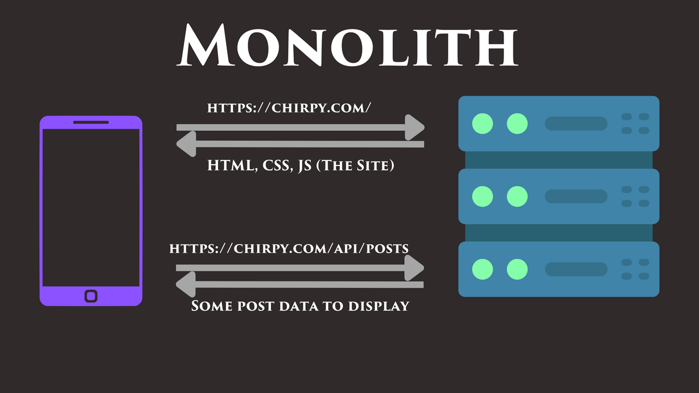
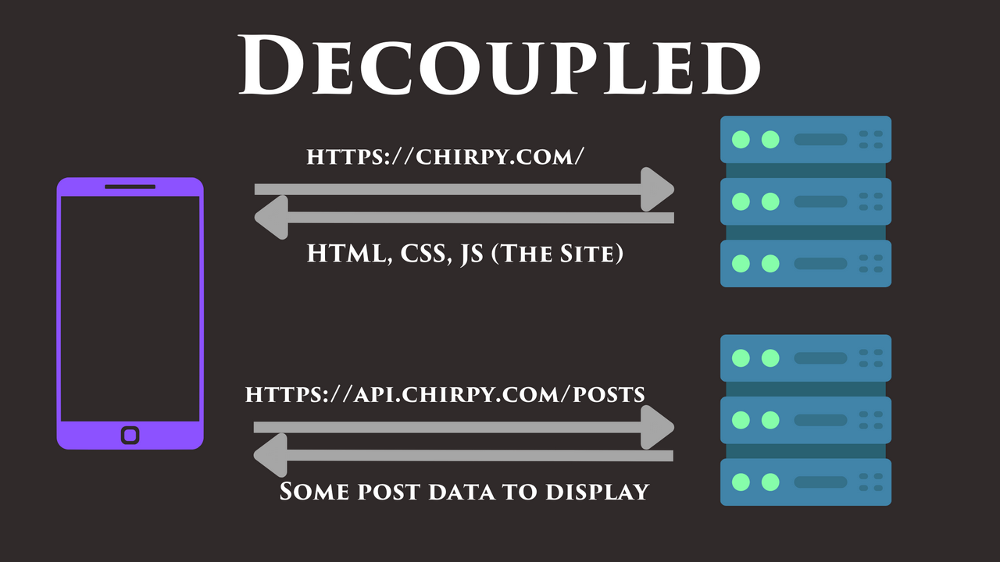

# architecture

## Monoliths and Decoupling
"Architecture" in software can mean many different things, but in this lesson, we're talking about the high-level architecture of a web application from a structural standpoint. More specifically, we are concerned with the separation (or lack thereof) between the back-end and the front-end.

When we talk about "coupling" in this context, we're talking about the coupling between the data and the presentation logic of that data. Loosely speaking, when I say "a tightly coupled front-end and back-end", what I mean is:

### Front-end: The Presentation Logic
If it's a web app, then this is the HTML, CSS, and JavaScript that is served to the browser which will then be used to render any dynamic data. If it's a mobile app, then this is the compiled code that is downloaded on the mobile device.

### Back-end: Raw Data
For an app like YouTube, this would be videos and comments. For an app like Twitter, this might be tweets and users data. You can't embed the YouTube videos directly into the Youtube app, because a user's feed changes each time they open the app. The app downloads new raw data from Google's back-end each time the app is opened.

### Monolith


A monolith is a single, large program that contains all of the functionality for both the front-end and the back-end of an application. It's a common architecture for web applications, and it what well be practicing building in this course.

Sometimes monoliths host a REST API for raw data (like JSON data) within a subpath, like `/api` as shown above. That said, there are even more tightly coupled monoliths that inject the dynamic data directly into the HTML as well. The nice thing about seperate nedpoints is that they can be consumed by any client and not just the website. That said, injection is typically more performant, so its a trade-off.


### Decoupled


A "decoupled" architecture is one where the front-end and back-end are separated into different codebases. For example, the front-end might be hosted by a static file server on one domain, and the back-end might be hosted on a subdomain by a different server.

Depending on whether or not a load balancer is sitting in front of a decoupled architecture, the API server might be hosted on a separate domain (as shown in the image) or on a subpath, as shown in the monolithic architecture. A decoupled architecture allows for either approach.

### Assignment
For now, Chirpy is technically a monolith. That said we eare keeping all the API logic decoupled in the sense that it will be served from its own namespace (path prefix). We serve the website from the `app` path, and we'll be serving the API from the `/api` path.

Let's move our non-website endpoints to the `/api` namespace in our routing.

To do this, prepend `/api` to the beginning of each of our API (non fileserver) endpoints.

## Which Is Better?
There is always a trade-off.

### Pros for Monoliths
* Simpler to get started.
* Easier to deploy new versions because everything is always in sync.
* In the case of the data being embedded in the HTML, the performance can result in better UX (user experience) and SEO (search engine optimization).

### Pros for Decoupled Architectures
* Easier, and probably cheaper, to scale as traffic grows.
* Easier to practice good seperation of concerns as the codebase grows.
* Can be hosted on seperate servers and using seperate technologies.
* Embedding data in the HTML is still possible with pre-rendering (similar to how Next.js works), it's just more complicated.

### Can we have the best of both worlds?
Perhaps. My recommendation to someone building a new application from scratch would be to start with a monolith, but to keep the API and the front-end decoupled logically within the project from the start (like we're doing with Chirpy).

That way, our app is easy to get started with, but we can migrate to a fully decoupled architecture later if we need to.

## Admin Namespace
Let's add an "admin" namespace. This is where we'll put endpoints intended for internal administrative use. Note: there's nothing inherently more secure about this namespace, it's just an organizational structure.

### Assignment
Swap out the `GET /api/metrics` endpoint, which just returns plain text, for a `GET /admin/metrics` that returns HTML to be rendered in the browser. Use this template with fmt.Sprintf():
```
<html>
  <body>
    <h1>Welcome, Chirpy Admin</h1>
    <p>Chirpy has been visited %d times!</p>
  </body>
</html>
```

## Deployment Options
We won't go in-depth with deployment instructions right now; that said, let's talk about how our choice of project architecture affects our deployment options, and how we could deploy our application in the future. We'll only talk about cloud deployment options here, and by the "cloud" I'm just referring to a remote server that's managed by a third-party company like Google or Amazon.

Using a cloud service to deploy applications is super common these days because it's easy, fast, and cheap.

That said, it's still possible to deploy to a local or on-premise server, and some companies still do that, but it's not as common as it used to be.

### Monolithic Deployment
Deploying a monolith is straightforward. Because your server is just one program, you just need to get it running on a server that's exposed to the internet and point your DNS records to it.

You could upload and run it on classic server, something like:
- AWS EC2
- GCP Compute Engine (GCE)
- Digital Ocean Droplets
- Azure Virtual Machines

Alternatively, you could use a platform that's specifically designed to run web applications, like:
- Heroku
- Google App Engine
- Fly.io
- AWS Elastic Beanstalk

### Decoupled Deployment
With a decoupled architecture, you have two different programs that need to be deployed. You would typically deploy your back-end to the same kinds of places you would deploy a monolith.

For your front-end server, you can do the same, or you can use a platform that's specifically designed to host static files and server-side rendered front-end apps, something like:
- Vercel
- Netlify
- GitHub Pages

Because the front-end bundle is likely just static files, you can host it easily on a CDN (Content Delivery Network) inexpensively.

### More powerful options
If you want to be able to scale your application up and down in specific ways, or you want to add other back-end servers to your stack, you might want to look into container orchestration options like Kubernetes and Docker Swarm.